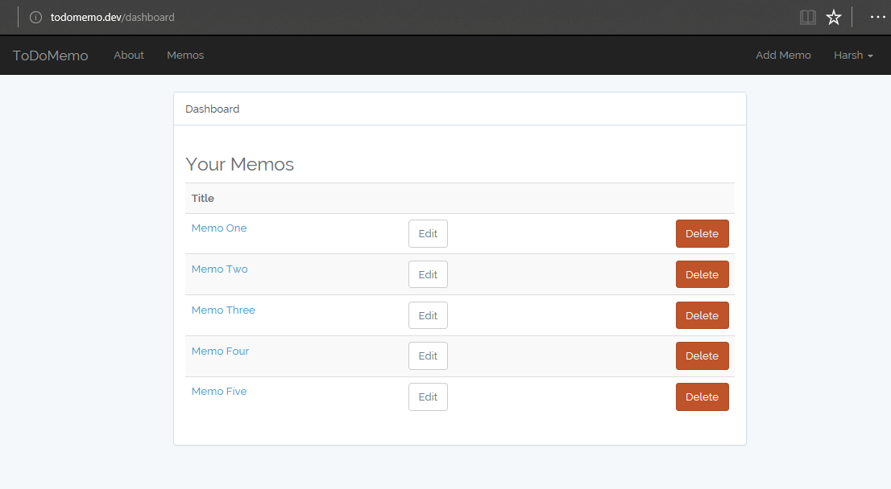

# MemosLaravel

> A simple memo web application made using Laravel. First dwelling into Laravel & MVCs. Uses Login, Resgistration, Authorization, CRUD fucntionalities

## Installation & Set-up

Requirements:
XAMPP or a similiar LEMP stack.
Clone this repository and put it in the ``htdocs`` folder.
Set up Apache ``vhost.conf`` and OS driver ``hosts`` file.
Create a database named "memo" using MySQL
Thats it!

## Release History

* 0.1.0
    * The first proper release
* 0.0.1
    * Work in progress
